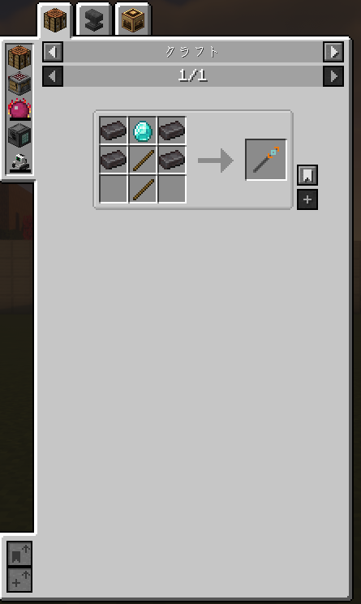

# Air Placement Wand Lite

<p align="center">
  
</p>

<p align="center">
  <strong>Standalone Air Placement Wand — Durability-based Frame Block Placement</strong>
</p>

<p align="center">
  
  
  
  
</p>

[日本語](#japanese) | [English](#english)

---

<a id="japanese"></a>
## 🇯🇵 日本語 (Japanese)

耐久値を消費して空中にフレームブロックを設置できる杖を追加するスタンドアロンModです。[Create: EMC Schematic Cannon](https://github.com/hololocheck/Create-EMC-Schematic-Cannon)の空中設置杖を、依存Modなしで使えるように移植・改良しました。

### 📦 依存Mod
| Mod | バージョン | 必須 |
|-----|-----------|------|
| なし | — | — |

依存Modなしで動作します。

### ✨ 追加アイテム・ブロック

#### 🪄 空中設置杖（アイテム）
耐久値を消費して、空中にフレームブロックを設置できる杖です。

| 項目 | 詳細 |
|------|------|
| 耐久値 | 400 |
| 設置コスト | 耐久値 1 / ブロック |
| 最大設置数 | 400個 |
| 設置距離 | 1〜15ブロック（デフォルト: 5） |
| エンチャント | 耐久・修繕に対応 |

**操作方法:**
| 操作 | 動作 |
|------|------|
| 右クリック（空中） | 視線方向の設定距離にフレームブロックを設置 |
| 右クリック（ブロック面） | クリックした面の隣にフレームブロックを設置 |
| Shift + 右クリック | この杖で設置した全フレームブロックを一括撤去 |
| Shift + スクロール | 設置距離を調整（1〜15ブロック） |
| Shift + ホイール押込み | 設置距離をデフォルト(5)にリセット |

- クリエイティブモードでは耐久値消費なし
- 設置したブロックの位置はアイテムに記録され、一括撤去に使用

#### 🔨 レシピ

通常の作業台でクラフトできます。

<p align="center">
  
  <br><em>作業台クラフト</em>
</p>

| アイテム | 必要個数 |
|---------|---------|
| ネザライトインゴット | 4 |
| ダイヤモンド | 1 |
| 棒 (Stick) | 2 |

---

#### 🧱 フレームブロック（ブロック）
空中設置杖で設置される透明な足場ブロックです。

| 項目 | 詳細 |
|------|------|
| 硬度 | 0.0（素手で即破壊） |
| 光透過 | あり（空を透過） |
| 窒息 | なし |
| 効果音 | 足場（Scaffolding） |
| ピストン | 押すと破壊 |
| ドロップ | なし |

- 松明やレッドストーンを設置可能
- 視界を遮らない透明ブロック
- 建築の足場として使用

### 🔧 ビルド方法

```bash
gradlew.bat build
```

出力: `build/libs/airplacementwandlite-1.0.0.jar`

---

<a id="english"></a>
## 🇺🇸 English

A standalone mod that adds a wand for placing Frame Blocks in mid-air using durability. Ported and improved from the Air Placement Wand in [Create: EMC Schematic Cannon](https://github.com/hololocheck/Create-EMC-Schematic-Cannon), with no mod dependencies.

### 📦 Dependencies
| Mod | Version | Required |
|-----|---------|----------|
| None | — | — |

Works without any dependencies.

### ✨ Added Items & Blocks

#### 🪄 Air Placement Wand (Item)
A wand that consumes durability to place Frame Blocks in mid-air.

| Spec | Detail |
|------|--------|
| Durability | 400 |
| Placement Cost | 1 durability / block |
| Max Placements | 400 |
| Placement Distance | 1–15 blocks (default: 5) |
| Enchantments | Unbreaking & Mending supported |

**Controls:**
| Input | Action |
|-------|--------|
| Right-click (air) | Place Frame Block at set distance in look direction |
| Right-click (block face) | Place Frame Block adjacent to clicked face |
| Shift + Right-click | Remove all Frame Blocks placed by this wand |
| Shift + Scroll | Adjust placement distance (1–15 blocks) |
| Shift + Middle Click | Reset distance to default (5) |

- No durability cost in Creative mode
- Placed block positions are stored in item data for bulk removal

#### 🔨 Recipe

Crafted on a standard crafting table.

<p align="center">
  
  <br><em>Crafting Table</em>
</p>

| Item | Quantity |
|------|----------|
| Netherite Ingot | 4 |
| Diamond | 1 |
| Stick | 2 |

---

#### 🧱 Frame Block (Block)
A transparent scaffolding block placed by the Air Placement Wand.

| Spec | Detail |
|------|--------|
| Hardness | 0.0 (instant break by hand) |
| Light Transmission | Yes (propagates skylight) |
| Suffocation | No |
| Sound | Scaffolding |
| Piston | Destroyed when pushed |
| Drop | None |

- Supports placement of torches and redstone
- Does not block vision — fully transparent
- Used as temporary scaffolding for construction

### 🔧 Build

```bash
gradlew.bat build
```

Output: `build/libs/airplacementwandlite-1.0.0.jar`

---

### 🛠 Technology Stack / 技術スタック
- **Platform**: [NeoForge](https://neoforged.net/) 21.1.168+ (Minecraft 1.21.1)

### 📄 License / ライセンス
[MIT License](LICENSE)
